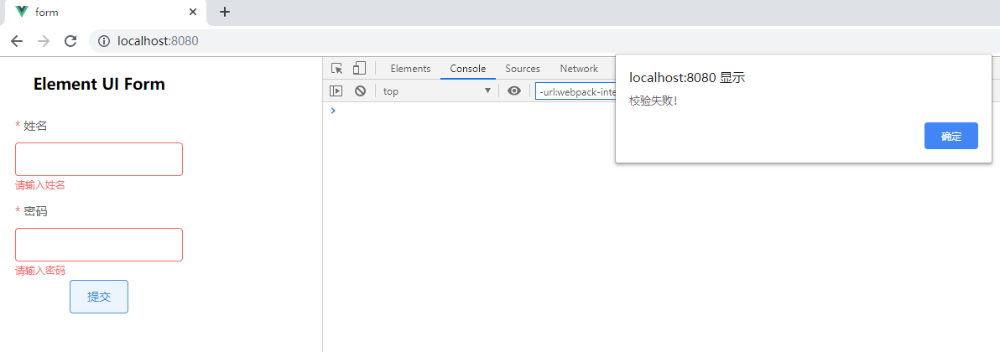

# 手写简易版的ElementUI表单组件

1. 环境准备
   - 使用vue cli3初始化一个项目
   - 引入ElementUI
2. 使用ElementUI实现登录表单
3. 思路分析
4. 手写简易版ElementUI表单组件
5. 总结

## 环境准备

初始化项目：

`vue create form`

运行项目：

`npm run serve`

引入ElementUI组件：

`npm i element-ui -S `

## 使用ElementUI实现登录表单

目标功能：

1. 一个用户名输入框、一个密码输入框
2. 空值校验
3. 表单提交校验

这里采用ElementUI实现登录表单功能的目的是为接下手写简易版表单组件整理思路以及之后的效果对比

这里直接贴出主要实现代码

```
<el-form :model="user" :rules="rules" ref="elForm">
  <el-form-item label="姓名" prop="username">
     <el-input v-model="user.username"></el-input>
  </el-form-item>
  <el-form-item label="密码" prop="password">
     <el-input type="password" v-model="user.password"></el-input>
  </el-form-item>
  <el-form-item>
     <el-button @click="submitForm('elForm')">提交</el-button>
  </el-form-item>
</el-form>

data(){
  return {
    user: {
      username: "Bingo",
      password: '123456'
    },
    rules: {
      username: [{required: true, message: '请输入姓名'}],
      password: [{required: true, message: '请输入密码'}]
    }
  }
}

methods: {
  submitForm(formName){ // 表单提交时候校验
    this.$refs[formName].validate((valid) => {
      if (valid) {
        alert('校验成功！');
      } else {
        alert('校验失败！');
      }
    })
  }
}
```

效果如下：



## 思路分析

表单组件主要由三部分组成

1. 表单容器：Form，传递数据给子组件使用（:model，:rules）

2. 表单项：FormItem
   - 显示label，显示表单元素，显示错误信息
   - 获取校验规则和当前模型值，校验执行

3. 表单元素：Input等表单元素，数据收集，输入或校验反馈
   - 双向绑定：监听@input，给:value赋值
   - 校验通知，因为只有此处知道数据发生变化

## 手写简易版ElementUI表单组件

参照ElementUI表单组件的组成，定义三个文件

MyInput.vue：表单元素，输入反馈

MyFormItem：表单项，显示表单元素，显示label，显示错误信息

MyForm：表单容器，传递数据给子组件使用

#### MyInput.vue

1. 创建MyInput.vue

   ```
   // <!-- :value接收传入的值，@input事件监听输入框值变化，并通知父级 -->
   <input :type="type" :value="value" @input="onInput">
   
   methods: {
     onInput(e){
       // 遵循单向数据流原则，这里转发事件即可
       this.$emit('input', e.target.value)
     }
   }
   ```

2. 创建测试代码myform/index.vue

   ```
   <div>
       <h3>My Form</h3>
       <my-input v-model="user.username"/>
       <my-input type="password" v-model="user.password"/>
       {{user}}
     </div>
     
   data(){
     return {
       user: {
         username: 'Bingo',
         password: '123456'
       }
     }
   }
   ```

   实现效果如下：

   

   此处优化补充：

   1. index.vue增加placehoder等input属性，在MyInput中采用v-bind="$attrs"接收并展开，优点是不需要在props中逐个声明接收

      ```
      // myform/index.vue
      <my-input placeholder="请输入姓名" v-model="user.username"/>
      <my-input type="password" placeholder="请输入密码" v-model="user.password"/>
      ```

      

      ```
      // MyInput.vue
      <input :type="type" :value="value" @input="onInput" v-bind="$attrs">
      ```

      

   2. inheritAttrs: false：由于所有通过$attrs接收的参数都会被拼到组件根节点，所以通过这个属性去除

      

      ```
      // MyInput.vue
      inheritAttrs: false,
      ```

   

#### MyFormItem.vue

1. 创建MyInput.vue，用于显示label，表单元素，错误信息

   ```
   <div>
     <!-- label -->
     <label v-if="label">{{label}}</label>
     <!-- 表单元素 -->
     <slot></slot>
     <!-- 错误信息 -->
     <p class="error" v-if="error">{{error}}</p>
   </div>
   ```

2. 在myform/index.vue使用

   ```
   <my-form-item label="姓名">
     <my-input placeholder="请输入姓名" v-model="user.username"/>
   </my-form-item>
   <my-form-item label="密码">
     <my-input type="password" placeholder="请输入密码" v-model="user.password"/>
   </my-form-item>
   ```

   效果如下：

   

#### MyForm.vue

1. 创建MyForm.vue，作为数据容器，传给MyFormItem和MyInput组件使用

   ```
   <div>
     <slot></slot>
   </div>
   ```

2. 在myform/index.vue使用，此时传入数据和校验规则

   ```
   <my-form :model="user" :rules="rules">
     <my-form-item label="姓名">
       <my-input placeholder="请输入姓名" v-model="user.username"/>
     </my-form-item>
     <my-form-item label="密码">
       <my-input type="password" placeholder="请输入密码" v-model="user.password"/>
     </my-form-item>
   </my-form>
   ```

3. 在MyForm组件中接收参数并传递给MyFormItem和MyInput组件使用

   ```
   props: {
     model: {
       type: Object,
       required: true
     },
     rules: {
       type: Object
     }
   },
   provide(){
     return {	
     	// this所指当前表单实例，后代可以通过该表单实例拿到所有参数，相比props逐个接收更方便
     	form: this
     }
   }
   ```

4. 在MyFormItem.vue中接收模型值和校验规则，并执行校验

   ```
   inject: ['form'],
   ```

5. 但此时在MyFormItem中虽然拿到rules，但不知道key，所以没法从rules中取数据，因此还需传入一个prop作为校验的key值

   ```
   // myform/index.vue
   <my-form-item label="姓名" prop="username">
   ...
   <my-form-item label="密码" prop="password">
   ...
   ```

6. 在MyFormItem中接收prop，并可以通过`this.form.rules[prop]`取到当前项的校验规则

   ```
   props: {
     prop: {
       type: String
     }
   }
   ```

7. 接下来安装一个依赖库用来做校验，`npm i async-validator -S`

8. 在MyInput.vue中通知校验

   ```
   onInput(e){
     ...
     // 通知校验，事件谁派发谁监听
     this.$parent.$emit('validate')
   }
   ```

9. MyFormItem中监听validate事件，并执行校验方法

   ```
   import Schema from 'async-validator'
   ...
   
   methods: {
     validate(){
       // 1.获取校验规则和当前值
       const rule = this.form.rules[this.prop]
       const value = this.form.model[this.prop]
       // 2.创建Schema实例
       const schema = new Schema({
         // [xxx]计算属性
         [this.props]: rule
       })
       // 3.使用该实例执行校验
       schema.validate({
         [this.props]: value
       },errors=>{
         if(errors){
           this.error = errors[0].message
         }else{
           this.error = ""
         }
       })
     }
   },
     
   mounted(){	// 此时子组件MyInput已经挂载完
     this.$on('validate', ()=>{
       this.validate()
     })
   }
   ```

效果如下：


10. 接下来还需要一个全局校验，当点击提交按钮时，做一个校验操作

    ```
    // myform/index.vue
    <my-form :model="user" :rules="rules" ref="myForm">
    ...
    <my-form-item>
      <button @click="submitLogin('myForm')">提交</button>
    </my-form-item>
    
    methods: {
      submitLogin(formName){
        this.$refs[formName].validate((isValidate)=>{
          if (isValidate) {
            alert('校验成功！');
          } else {
            alert('校验失败！');
          }
        })
      }
    }
    ```

11. 此时MyForm需要有一个validate方法，用来执行全局校验

    ```
    // MyForm.vue
    
    methods: {
      validate(){
        // 调用所有myformitem的validate，只要一个失败就失败 
      }
    }
    ```

12. 由于MyFormItem中校验方法validate返回一个Promise，因此直接将其返回

    ```
    // 3.使用该实例执行校验
    return schema.validate({
    ...
    ```

13. 此时在MyForm中可以通过map遍历执行所有myformitem校验并得到一个promise数组，最后通过Promise.all([])执行该数组即可知道全局校验结果

    ```
    validate(cb){
      // 调用所有myformitem的validate，只要一个失败就失败
      // 此处得到一个promise数组，是所有form-item执行校验的结果集
      const validateResults = this.$children.map(item=>item.validate())
    
      // 判断所有结果
      Promise.all(validateResults)
        .then(()=>cb(true))
        .catch(()=>cb(false))
    }
    ```

效果如下：


14. 此时校验结果报错，原因是在执行全局校验，即遍历formitem校验时，提交按钮所处的表单项也被纳入校验，而此时按钮表单项并没有prop属性，因此报错；解决办法是过滤掉没有prop属性的表单项校验

    ```
    // MyForm.vue
    const validateResults = this.$children
            .filter(item=>!!item.prop)  // 留下带prop属性的项
            .map(item=>item.validate())
    ```

效果如下：


OK！！！，完成一个简易版的Element的Form组件，并成功实现了表单项校验及全局校验

## 总结

简易版的表单组件在设计思路上与Element的Form组件相似，有助于更好的去使用和理解组件库，其中对于Vue的几种组件通信方式的使用也加深了对组件通信的理解。

[项目地址](https://github.com/BingoVue/form.git)

